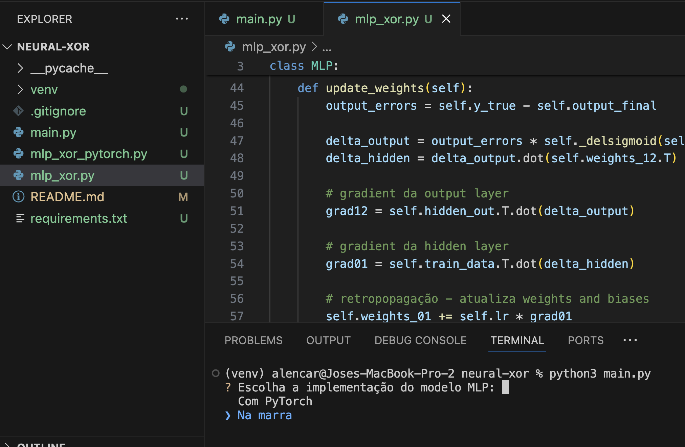

# Neural-XOR


Atividade para resolver o problema do XOR com Rede Neural em Multi-Layer Perceptron (MLP)

## Contexto
O problema XOR é um clássico desafio em Deep Learning, que não pode ser resolvido usando perceptrons simples devido à sua não-linearidade. A solução eficaz para tal problema envolve a implementação de uma rede neural com pelo menos uma camada escondida, permitindo a modelagem de decisões não lineares.

## Funcionalidades
Este projeto inclui duas implementações principais para resolver o problema XOR usando uma rede neural do tipo MLP:
1. **Implementação com PyTorch**: Utiliza a biblioteca PyTorch, que facilita a construção e o treinamento de redes neurais com auto-gerenciamento de gradientes e outras funcionalidades de aprendizado de máquina.
2. **Implementação Manual (Na Marra)**: Uma implementação básica que detalha manualmente a inicialização dos pesos, a passagem para frente (forward pass), o cálculo de erro, e o ajuste dos pesos via backpropagation, sem o uso de frameworks.

## Como usar

### Configuração do Ambiente Virtual

Recomenda-se o uso de um ambiente virtual para evitar conflitos de dependências. Para criar e ativar um ambiente virtual, execute:

```bash
python -m venv venv
source venv/bin/activate  # No Windows use `venv\Scripts\activate`
```

### Execução via CLI

O projeto está configurado para permitir a escolha da implementação via linha de comando:
```bash
python main.py
```

Após executar o comando acima, selecione a implementação desejada usando as setas do teclado e confirme com a tecla Enter.

### Detalhes da Implementação

**Inicialização de Pesos e Vieses**

A rede inicializa dois conjuntos de pesos e vieses:

	•	weights_01 e bias_01 para conexões entre a camada de entrada e a camada escondida.
	•	weights_12 e bias_12 para conexões entre a camada escondida e a camada de saída.

**Forward pass**

	•	Ativação da Camada Escondida: Os dados de entrada são primeiro multiplicados por weights_01 e depois somados a bias_01. O resultado passa pela função de ativação (nesse caso sigmoid) para produzir a saída da camada escondida.
	•	Ativação da Camada de Saída: A saída da camada escondida é então multiplicada por weights_12 e adicionada a bias_12. O resultado passa novamente pela função de ativação para produzir a saída final da rede.

**Retropropagação**

Durante o treinamento, após a passagem para frente, a rede calcula o erro entre as saídas previstas e os valores-target reais. Em seguida, realiza a retropropagação para ajustar weights_12 e weights_01 (assim como bias_12 e bias_01) usando gradientes calculados a partir desse erro.

**Treinamento**

O treinamento envolve repetidamente realizar passagens para frente e retropropagação ao longo de um número especificado de épocas para minimizar o erro e ajustar os pesos e vieses para modelar melhor os dados.

**Importância do PyTorch**

PyTorch oferece diversas facilidades para treinamento de redes neurais, incluindo gerenciamento automático de gradientes, o que simplifica significativamente a implementação de algoritmos de aprendizado profundo. Sua flexibilidade e dinâmica permite um desenvolvimento rápido e iterativo, o que o torna ideal para experimentos e prototipagem rápida em pesquisa de deep learning.